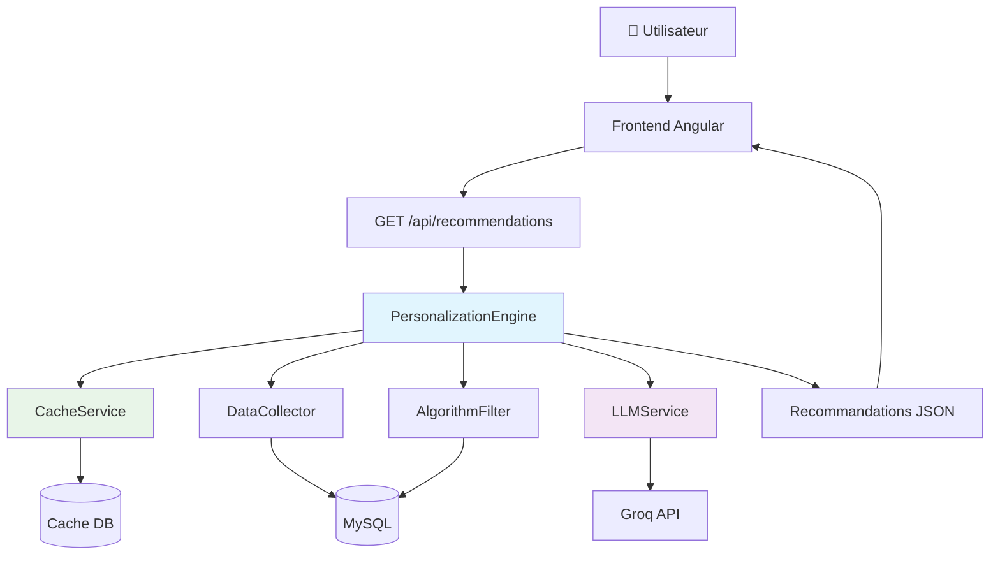
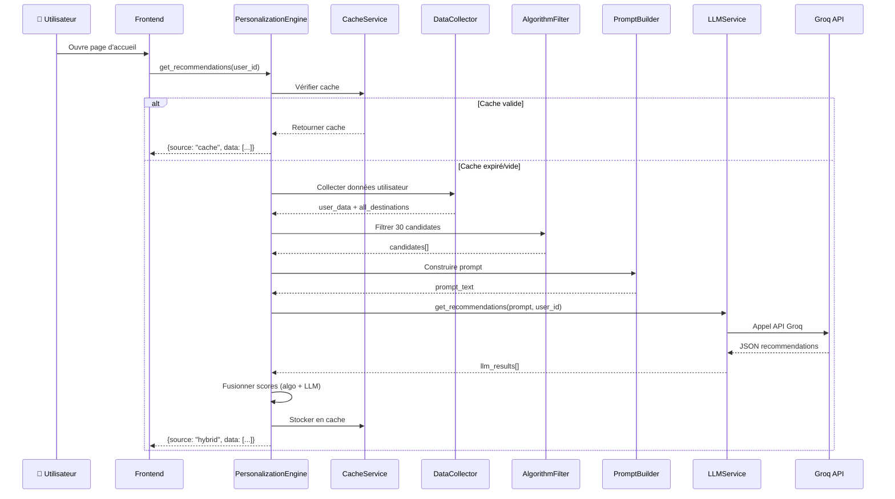
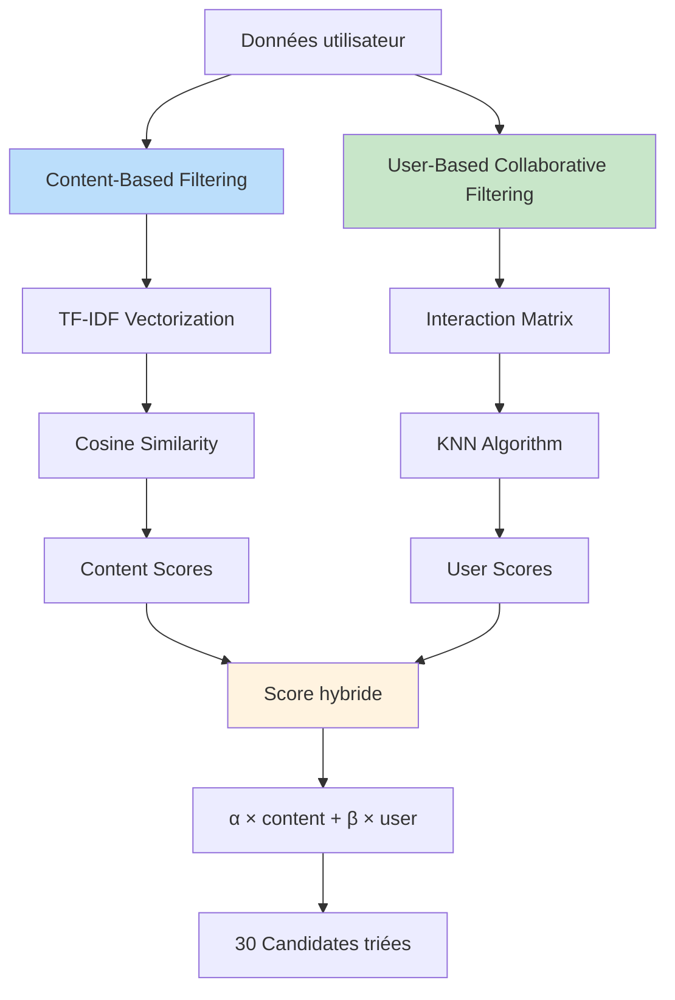
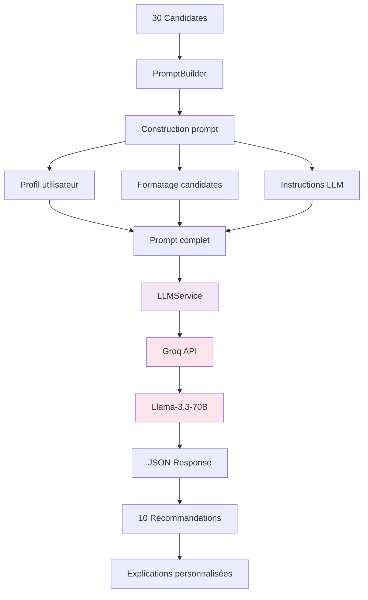
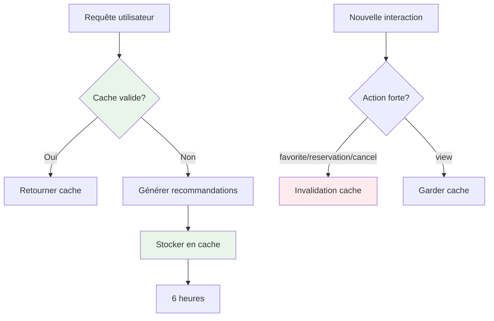
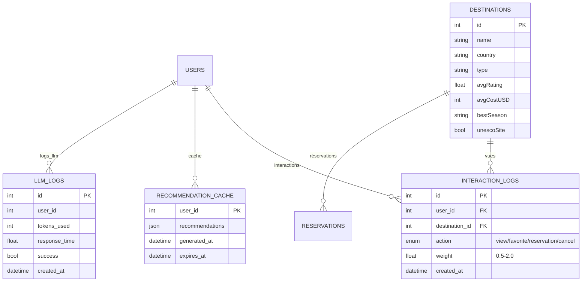
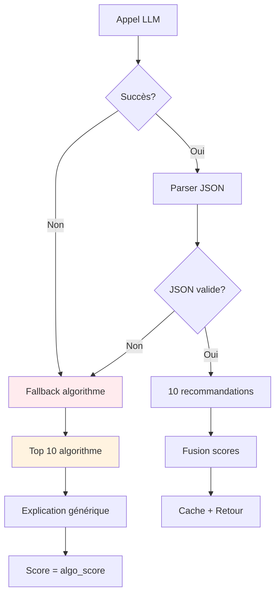
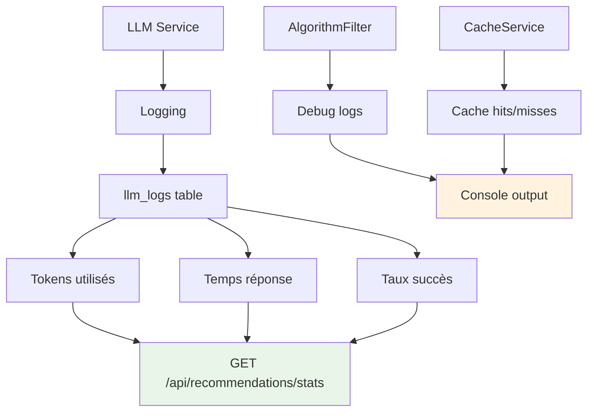
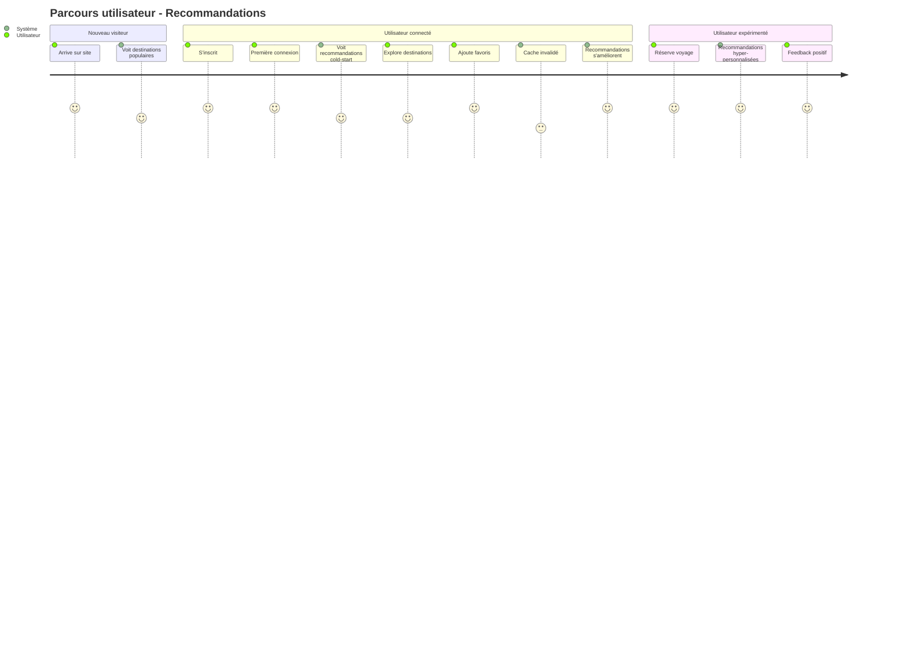
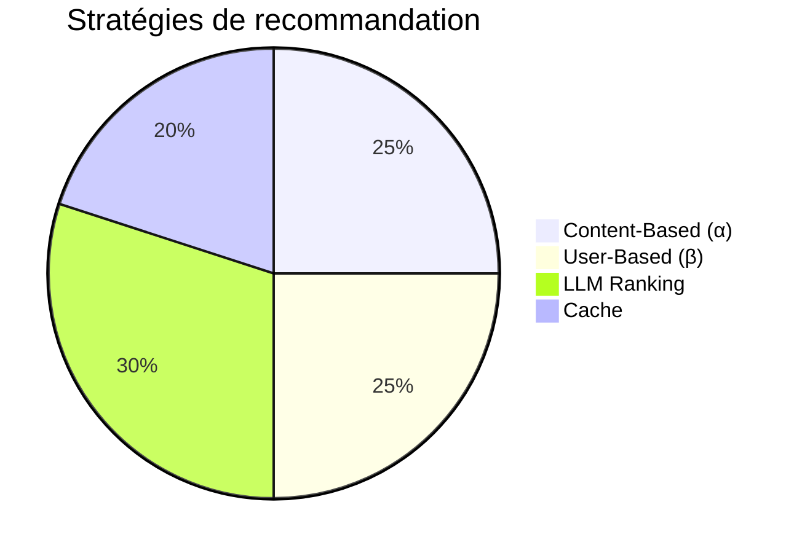

# 📊 Schémas Visuels - Système de Recommandations LLM

## Table des matières

1. [Architecture générale](#architecture-générale)
2. [Flux de données détaillé](#flux-de-données-détaillé)
3. [Algorithme hybride](#algorithme-hybride)
4. [Intégration LLM](#intégration-llm)
5. [Système de cache](#système-de-cache)
6. [Base de données](#base-de-données)

---

## Architecture générale



---

## Flux de données détaillé



---

## Algorithme hybride



**Légende des poids :**

- α (Content-Based) : 0.5 - 1.0
- β (User-Based) : 0.0 - 0.5
- **Ajustés selon nombre d'interactions utilisateur**

---

## Intégration LLM



**Configuration LLM :**

```json
{
  "model": "llama-3.3-70b-versatile",
  "temperature": 0.3,
  "max_tokens": 2000,
  "response_format": { "type": "json_object" }
}
```

---

## Système de cache



**Stratégie de cache :**

- **Durée :** 6 heures
- **Invalide pour :** favoris, réservations, annulations
- **Avantages :** Performance + Réduction coût LLM

---

## Base de données



---

## Score final - Formule détaillée

```mermaid
graph TD
    A[Score algorithme] --> C[0.4 ×]
    B[Score LLM] --> D[0.6 × (llm_score/10)]
    C --> E[Score final]
    D --> E

    F[Score LLM brut] --> G[6.0 - 10.0]
    G --> H[Normalisation /10]
    H --> I[0.6 - 1.0]
    I --> D

    style E fill:#fff3e0
    style C fill:#e3f2fd
    style D fill:#f3e5f5
```

**Exemple concret :**

```
Destination Barcelona:
├── Score algorithme = 0.85
├── Score LLM brut = 9.2
├── Score LLM normalisé = 9.2/10 = 0.92
├── Score final = 0.4×0.85 + 0.6×0.92 = 0.34 + 0.552 = 0.892
```

---

## Gestion des erreurs et fallbacks



**Fallback garantit :**

- ✅ Toujours 10 recommandations
- ✅ Scores algorithmiques fiables
- ✅ Explications basiques
- ✅ Service continu même si LLM down

---

## Métriques et monitoring



**Métriques trackées :**

- **Performance LLM :** Temps réponse moyen, tokens utilisés
- **Fiabilité :** Taux de succès des appels
- **Cache :** Hit rate, invalidations
- **Algorithme :** Nombre candidates, scores moyens

---

## Flux utilisateur complet



---

## Comparaison stratégies



**Répartition des poids :**

- **Algorithme :** 40% du score final
- **LLM :** 60% du score final
- **Cache :** 100% des performances

---

**Fin des schémas visuels** 📈
